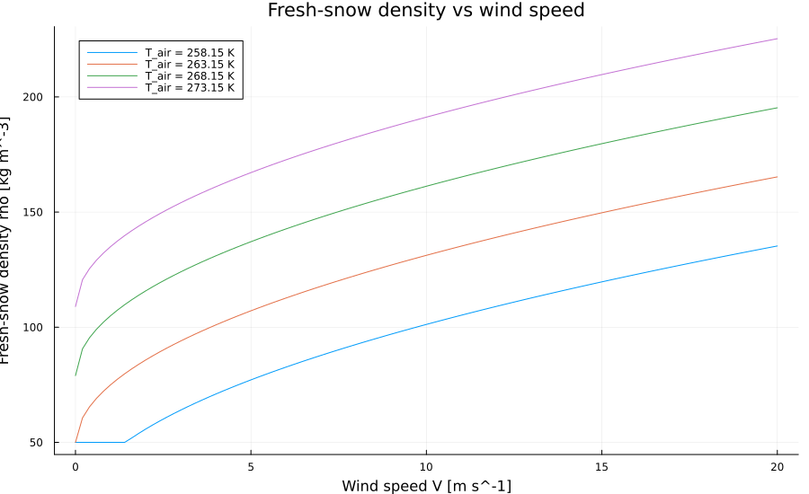

```@meta
CurrentModule = Chion
```

# Accumulation And Melt

Accumulation and melt are handled by the internal helpers `_apply_accumulation!`
and `_apply_melt!`, which are called from [`step!`](@ref). They are documented
here because they define the model behavior, but the intended public entry
point is [`step!`](@ref).

## Accumulation

With snowfall rate ``P_{\mathrm{snow}}`` and rainfall rate
``P_{\mathrm{rain}}`` in ``\mathrm{kg\,m^{-2}\,s^{-1}}`` and timestep
``\Delta t`` in seconds, the added masses are

```math
\Delta m_{\mathrm{snow}} = P_{\mathrm{snow}}\Delta t,
\qquad
\Delta m_{\mathrm{rain}} = P_{\mathrm{rain}}\Delta t.
```

If the column is empty, a new surface layer is created only when snowfall is
positive. Rain alone does not create a snow layer.

### Fresh-Snow Density

When `fresh_snow_density_scheme = :constant`, the code uses `rho_s` clamped to
`[50, rho_i]`.

When `fresh_snow_density_scheme = :parameterized`, the code uses

```math
\rho_\mathrm{fresh} = a + b\,(T_\mathrm{air} - T_0) + c\,\sqrt{V},
```

with default coefficients `a = 109`, `b = 6`, and `c = 26`, optional wind
speed `V`, and final clamp to ``[50, \rho_i]``.



If snowfall is added to an existing surface layer, the new bulk density is
mixed by conserving layer volume:

```math
\rho_1^{new} =
\frac{m_1^{old} + \Delta m_{\mathrm{snow}}}
{m_1^{old}/\rho_1^{old} + \Delta m_{\mathrm{snow}}/\rho_\mathrm{fresh}}.
```

Rainfall is added directly to the surface liquid-water store `mass_w[1]` when a
snow layer exists.

### Layer-Structure Enforcement

After mass addition, the code:

1. splits the surface layer when `mass[1] > mass_max`
2. frees space at the bottom when all `Ntot` layers are already active
3. merges or rebalances the surface when `mass[1] < mass_min`
4. applies the excess-mass cap described on the
   [Layer Structure And Basal Transfer](layer_structure.md) page

## Melt

`_apply_melt!` removes requested melt mass from the top downward, converts that
mass into liquid water in the current layer, and leaves the later retention and
refreezing decisions to [`go_percolation!`](@ref) and
[`go_refreezing!`](@ref).

Given a requested melt amount ``m_{\mathrm{melt}}``:

1. clamp the request to nonnegative values
2. remove up to the available solid mass from the surface layer
3. add the removed mass to the surface liquid-water store
4. if the surface layer is depleted, route its remaining liquid water into the
   next layer or to runoff and remove the empty layer
5. if the surface layer remains but falls below `mass_min`, merge or rebalance
   it with the next layer

## Interaction In `step!`

The accumulation-and-melt-related ordering in one call to [`step!`](@ref) is:

1. `_apply_accumulation!`
2. densification
3. [`go_energy_flux!`](@ref)
4. `_apply_melt!` when melt energy is available
5. [`go_percolation!`](@ref)
6. HTESSEL liquid-water compaction when enabled
7. [`go_refreezing!`](@ref)

## Internal Reference

```@docs; canonical=false
_fresh_snow_density
_apply_accumulation!
_apply_melt!
```
